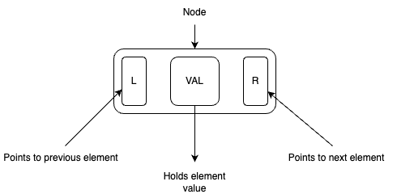
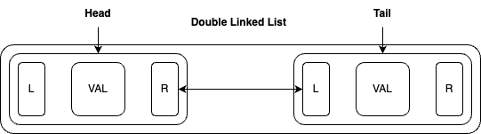
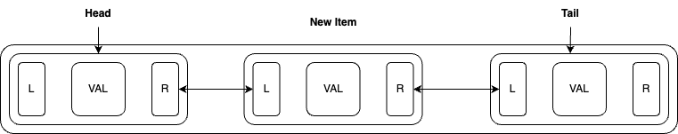

### LRU Cache in GO

#### Introduction to caching
**Caching** refers to the process of storing data, either in hardware or software components, to facilitate quicker retrieval of that data for future requests. 

It's particularly useful for operations that are resource-intensive, where the results remain unchanged for a period of time. This could include computations involving complex algorithms operating on large datasets or database queries. By caching the results with appropriate invalidation rules, we can ensure that the most recent values are retained, preventing outdated data from being presented to end-users.

#### LRU Caching - Introduction
To grasp the fundamentals of caching, let's explore a basic variant known as LRU (Least Recently Used) caching. The core principle revolves around retaining only the references to the least recently accessed data. When a new value is introduced for a particular element in the cache, the existing entry is evicted and the new value is inserted at the forefront.

#### LRU Caching - Implementation Abstract
There are several implementations of LRU Cache, but the two main ones are:

- **Double Linked List with Hash Map**: This is a classic implementation where a double linked list is used to maintain the order of elements based on access time. A hash map is employed to provide constant-time access to elements stored in the cache.

- **Clock (Approximate LRU)**: This implementation doesn't strictly follow the least recently used policy but approximates it. It uses a circular buffer or array where each element has a "use" or "bit" flag. When an element is accessed, its flag is set to indicate recent use. When an element is to be evicted, the algorithm scans the circular buffer and evicts the first element it encounters with its flag not set.

Other variants include LRU-K, Segmented LRU, and more.

We will foucs on **Double Linked List with Hash Map**, as it is high-efficient, constant-time access and manipulation implementation, which makes it highly effective for most scenarios.

#### LRU Caching - Double Linked List
 
Let's explore the mechanics of a double linked list:



At its core is the **Node**, consisting of three vital components:

- **Value**: Represents the specific information associated with each list element, accommodating various data types such as strings, integers, complex structures, or arrays.
- **L (Left)**: Indicates the previous node in the list.
- **R (Right)**: Indicates the next node in the list.

\


Nodes are then utilized to construct the **Head** and **Tail**. These are special nodes that serve as anchors, pointing to the first and last elements of the list, respectively. In the absence of elements, when the list is empty, they self-referentially point to each other. While not part of the list like other elements, they function as auxiliary entities, facilitating navigation to the actual first and last values.

\


The insertion process is fairly simple: we insert a new item before the existing first element while also updating references in the head and the existing first element. Now, the `R (Right)` pointer of the head will point to the newly inserted node's `L (Left)`. For the previous first element, we point the new node's `R (Right)` to the previous element's `L (Left)`.

The deletion process is essentially the reversal of insertion. Initially, we identify the element we want to delete and keep a [reference](https://en.wikipedia.org/wiki/Reference_(computer_science)#:~:text=In%20computer%20programming%2C%20a%20reference,is%20called%20dereferencing%20the%20reference.) to it. When we remove this element from our list, the left and right nodes of the removed element lose their references to it. Therefore, we need to update these nodes to point to each other. Depending on the implementation, you can choose whether to return the removed element or not. If you're working with pointers and decide not to return the removed element, and none of the nodes point to it, then it will be removed from memory during garbage collection process. Keep that in mind.

#### LRU Caching - Hash Map

By integrating a hash map into the LRU cache architecture, we enhance its capabilities with swift key-based lookup (O(1)) for cache entries. Additionally, the hash map acts as a safeguard against duplicate entries and enables efficient removal of items. This dual functionality not only streamlines cache operations but also elevates the overall performance and integrity of the cache system.

#### LRU Caching - Implementation

Let's outline the key operations our cache should support:
- **Add Item**: Insert a new item into the cache.
- **Remove Item**: Remove an existing item from the cache.
- **Check Item**: Check if an item with the provided key exists in the cache. If it does, delete the current value and insert the new value at the beginning.

Additionally, we'll include helper functions such as `CreateCache`, `CreateQueue`, and `Display`. Our cache will be of fixed length.

First, let's define our `main` function where we'll test our cache:

```go
  func main() {
    elementsToCache := []string{"Dog", "Cat", "Soda", "Tee", "Dog", "Terry"}
  }
```

We'll keep things simple and only cache string values, but remember that you can cache any data types—strings, ints, custom structures, slices, etc.

Now, let's determine how our cache will look:

```go
// Determine size of the cache
const CACHE_SIZE = 5

// Main structure for our cache - holds linked list and hash map
type Cache struct {
  LinkedList LinkedList
  Hash Hash
}

// Single Node within linked list
type Node struct {
  Value string
  Left *Node
  Right *Node
}

// Linked List with pointers to Head and Tail, along with length of the list
type LinkedList struct {
  Head *Node
  Tail *Node
  Length int
}

// Hash map to store cache entries
type Hash map[string]*Node
```

Now, we need functions for creating a cache and linked list. Other structs will be created in the standard way:

```go
func createCache() Cache {
	return Cache{
		LinkedList: createLinkedList(),
		Hash:       Hash{},
	}
}

func createLinkedList() LinkedList {
	head := &Node{}
	tail := &Node{}

	head.Right = tail
	tail.Left = head

	return LinkedList{
		Head:   head,
		Tail:   tail,
		Length: 0,
	}
}
```

Let's create cache in the main function:
```go
  func main() {
    elementsToCache := []string{"Dog", "Cat", "Soda", "Tee", "Dog", "Terry"}

    // Create new cache instance for program
    cache := createCache()
  }
```

Now, let's define our `Add` and `Delete` operations for the linked list, which will manage cache items. To keep the code simple, I will define these functions as struct functions of `Cache` directly. However, ideally, they should be part of `LinkedList`, and `Cache` should serve as a wrapper for their invocation.

I will provide this directly under this code block, but in the rest of the code, I'll use direct invocation.

```go
// Direct variant
func (c *Cache) Add(node *Node) {
  // Keep the refernce of current first value, which is also the right value of head.
  prevFirstValue := c.LinkedList.Head.Right

	// Set new first value of new node, by setting right node of head to it.
  c.LinkedList.Head.Right = node

	// Left of current node should point to head, and right of current node should point to prev first node.
  node.Left = c.LinkedList.Head
  node.Right = prevFirstValue
  prevFirstValue.Left = node

  c.LinkedList.Length += 1

  /* If we exceed size of the cache, we drop last element which
  is the least accessed element, so we consider this as one of cache invalidation rules */
  if c.LinkedList.Length > CACHE_SIZE {
    c.Remove(c.LinkedList.Tail.Left)
  }
}

func (c *Cache) Remove(node *Node) *Node {
  // Get the reference to current node left and right values nodes
  left := node.Left
  right := node.Right

  // Point previously fetched values to each other.
  left.Right = right
  right.Left = left

  // Remove provided node from cache hash, and decrement the total linked list length.
  delete(c.Hash, node.Value)
  c.LinkedList.Length -= 1

  return node
}
```

```go
// More cleaner approach
func (c *Cache) Add(node *Node) {
  c.LinkedList.Add(node)
}

func (c *Cache) Remove(node *Node) *Node {
  return c.LinkedList.Remove(node)
}

func (ll *LinkedList) Add(node *Node) {...}

func (ll *LinkedList) Remove(node *Node) {...}
```

Time to declare the `Check` function responsible for managing cache values. In this implementation, both the keys and node values in our hash map are strings. When encountering a new value for an existing key, I re-insert the corresponding node at the beginning of the linked list, skipping the initialization of a new node as it is unnecessary. I only initialize a new node when the value is not present in the cache.

In more advanced scenarios, you may need to introduce custom cache invalidation and refresh logic. However, in most cases, simply checking if a value with this key exists in the cache and re-inserting it suffices.

It's important to note that if your node values contain more complex data, you may not want to re-insert existing values. Instead, you might prefer to always create new nodes while releasing memory from the old ones.


```go
func (c *Cache) Check(n string) {
  var node *Node

  /* Check if value is in the cache hash; If it is, then remove it,
   and add as recently used value; If not create and also add to cache hash. */
  if existingCacheValue, ok := c.Hash[n]; ok {
    node = c.Remove(existingCacheValue)
  } else {
    node = &Node{Value: n}
  }

  c.Add(node)
  c.Hash[n] = node
}
```

Finally, let's add methods for displaying `Cache` content and update our main function to test caching:
```go
func (c *Cache) Display() {
	c.LinkedList.Display()
}

func (q *LinkedList) Display() {
	node := q.Head.Right

	fmt.Printf("%d - [", q.Length)
	for i := 0; i < q.Length; i++ {
		fmt.Printf("{%s}", node.Value)
		if i < q.Length-1 {
			fmt.Printf("<-->")
		}
		node = node.Right
	}
	fmt.Println("]")
}

func main() {
	elementsToCache := []string{"Dog", "Cat", "Soda", "Tee", "Dog", "Terry"}

	cache := createCache()

	for _, e := range elementsToCache {
		cache.Check(e)
		cache.Display()
	}
}
```

Let's see the results:
```sh
❯ go run main.go

1 - [{Dog}]
2 - [{Cat}<-->{Dog}]
3 - [{Soda}<-->{Cat}<-->{Dog}]
4 - [{Tee}<-->{Soda}<-->{Cat}<-->{Dog}]
4 - [{Dog}<-->{Tee}<-->{Soda}<-->{Cat}]
5 - [{Terry}<-->{Dog}<-->{Tee}<-->{Soda}<-->{Cat}]
5 - [{Car}<-->{Terry}<-->{Dog}<-->{Tee}<-->{Soda}]
```

The cache pushes new values of existing entries to the beginning, indicating recent use. Old entries are dropped when the cache size exceeds the maximum, ensuring efficient memory usage. Memory is optimized by reusing existing nodes and managing entries with pointers.

#### Benchmark

```sh
❯ go run main.go
Time taken to fill cache with 1000000 elements: 273.991042ms
Time taken to find element in cache hash: 334ns
```

```sh
❯ go run main.go
Time taken to fill cache with 10000000 elements: 3.080347667s
Time taken to find element in cache hash: 417ns
```
We filled up our cache with milions and milions of items, it tooks a bit of time, but thanks to hash map we can have enormous amounts of data cached and access it within nano-seconds.

Summary of operations time complexity:
- Add - O(1): The Add operation inserts a new node into the cache. In the implementation using a doubly linked list and hash map, the time complexity of adding a new node is O(1) because we directly insert the node at the beginning of the linked list and update the hash map with constant-time access.

- Remove - O(1): The Remove operation removes a node from the cache. Similar to the Add operation, the time complexity of removing a node is O(1). It involves updating the pointers of adjacent nodes in the linked list and deleting the corresponding entry from the hash map, both of which are constant-time operations.

- Display - O(n): The Display operation traverses the entire linked list to print its contents. In the worst-case scenario, where the entire linked list needs to be traversed, the time complexity is O(n), where n is the number of elements in the linked list. This complexity arises from the need to visit each node in the list once to display its value.

Project includes tests and benchmark for described implementation.